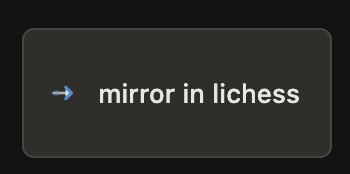

# ChessTempo → Lichess mirror

Tampermonkey userscript: while editing a repertoire on **ChessTempo opening training**, open **Lichess analysis** at the same position and keep the analysis board in sync when you navigate on CT.



**Release notes:** [v0.1.22](./docs/RELEASE-v0.1.22.md)

## Install

1. Install Tampermonkey.
2. Install from **Greasy Fork** (once listed) or the raw GitHub script (Tampermonkey “Check for userscript updates” if already installed):

   `https://raw.githubusercontent.com/pedro-mass/userscripts/main/packages/chesstempo-lichess-mirror/dist/chesstempo-lichess-mirror.user.js`

3. Enable on `chesstempo.com` and `lichess.org`.

From source:

```bash
cd repos/userscripts
pnpm install
pnpm --filter @userscripts/chesstempo-lichess-mirror build
# install dist/chesstempo-lichess-mirror.user.js in Tampermonkey
```

## Usage

1. Open **ChessTempo** opening training / repertoire editor.
2. Click **mirror in lichess** (floating button, bottom-right). A Lichess analysis tab opens with `?pamMirror=<id>`.
3. Navigate on CT — the paired Lichess tab plays one move when possible, otherwise reloads analysis at the new FEN.

Repertoire edits stay on ChessTempo only; Lichess is a read-only mirror for explorer / engine / LiChess Tools.

## Dev

```bash
cd repos/userscripts
pnpm install
pnpm --filter @userscripts/chesstempo-lichess-mirror dev
```

Tests: `pnpm --filter @userscripts/chesstempo-lichess-mirror test`

Browser verify (Brave + Tampermonkey): [docs/verify-in-browser.md](./docs/verify-in-browser.md).  
Launch Brave CDP from PAM: `./scripts/launch-brave-remote-debug.sh`.
